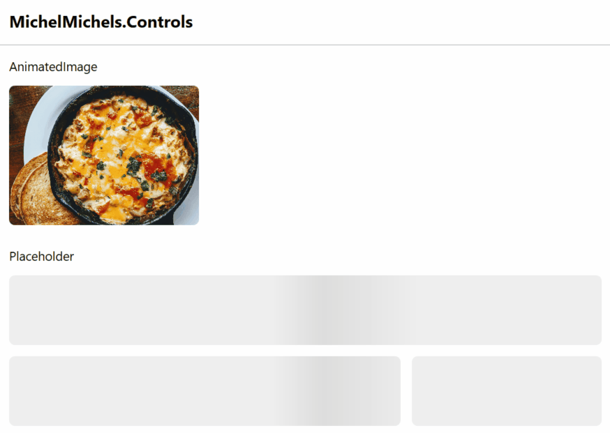

<a name="readme-top"></a>

<!-- PROJECT SHIELDS -->
[](https://www.nuget.org/packages/MichelMichels.Controls/)

<!-- PROJECT LOGO -->
<br />
<div align="center">
  <a href="https://github.com/MichelMichels/wpf-controls">
    
  </a>

<h3 align="center">MichelMichels.Wpf.Controls</h3>

  <p align="center">
    Controls for WPF
    <br />
    <a href="https://github.com/MichelMichels/wpf-controls/issues/new?assignees=&labels=bug&projects=&title=">Report Bug</a>
    ·
    <a href="https://github.com/MichelMichels/wpf-controls/issues/new?assignees=&labels=enhancement&projects=&title=">Request Feature</a>
  </p>
</div>

<!-- TABLE OF CONTENTS -->
<details>
  <summary>Table of Contents</summary>
  <ol>
    <li>
      <a href="#getting-started">Getting Started</a>
      <ul>
        <li><a href="#prerequisites">Prerequisites</a></li>
        <li><a href="#installation">Installation</a></li>
      </ul>
    </li>
    <li><a href="#documentation">Documentation</a></li>
    <li><a href="#contributing">Contributing</a></li>
    <li><a href="#license">License</a></li>
    <li><a href="#contact">Contact</a></li>
  </ol>
</details>

<!-- GETTING STARTED -->
## Getting Started

Clone the repository, build and run one of the projects.

### Prerequisites

* Visual Studio 17.5+
* WPF workload
* .NET 7.0  

### Installation

1. Clone the repo
   ```sh
   git clone https://github.com/MichelMichels/wpf-controls.git
   ```
2. Open VS
3. Open the `MichelMichels.Wpf.Controls.sln` solution file.

<p align="right">(<a href="#readme-top">back to top</a>)</p>

<!-- DOCUMENTATION -->
## Documentation

This is a list of controls that are currently included in this library.

| Name             | Description                                                                                                                                          |
| ---------------- | ---------------------------------------------------------------------------------------------------------------------------------------------------- |
| Placeholder      | This is a control to put in place when content is loaded afterwards, to setup some layout structure.                                                 |
| PlaceholderImage | This control uses a placeholder while loading in the image. After the image is loaded, the placeholder will disappear by using an opacity animation. |
| ChromeWindow     | Window with custom chrome.                                                                                                                           |
| MinimizeButton   | Button for minimizing a Window.                                                                                                                      |
| RestoreButton    | Button for restoring a Window.                                                                                                                       |
| MaximizeButton   | Button for maximizing a Window.                                                                                                                      |
| CloseButton      | Button for closing a Window.                                                                                                                         |
| WindowControls   | Container for holding the buttons of a Window.                                                                                                       |


<!-- CONTRIBUTING -->
## Contributing

1. Clone the Project
2. Choose an issue from the [issues page](https://github.com/MichelMichels/wpf-controls/issues)
3. Let GitHub create a branch for you
4. Commit your Changes and include the issue number in the commit message (`git commit -m 'Fix #1337 - Fix implemented'`)
5. Push to the Branch (`git push`)
6. Open a Pull Request

<p align="right">(<a href="#readme-top">back to top</a>)</p>

<!-- LICENSE -->
## License and ownership

[Licensed under MIT license by Michel Michels](LICENSE).


<p align="right">(<a href="#readme-top">back to top</a>)</p>

<!-- CONTACT -->
## Contact

* [**Michel Michels**](https://github.com/MichelMichels) - *Project owner/maintainer* 

Project Link: [https://github.com/MichelMichels/wpf-controls](https://github.com/MichelMichels/wpf-controls)

<p align="right">(<a href="#readme-top">back to top</a>)</p>
